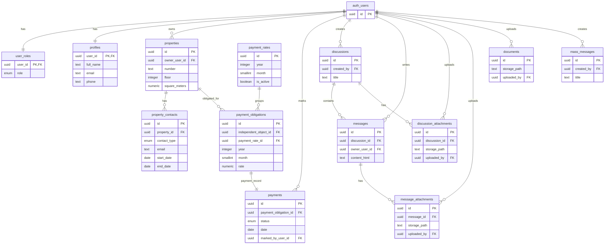

# DOM Project Documentation

## 1) Project Description

**DOM** is a web application for managing operations in a shared residential building (home building / condominium).

### Main user roles

- **Admin**
  - Manages properties, user-related data, monthly obligations, documents, and mass messages.
  - Can mark obligations as paid.
  - Can access admin routes (`/admin`, `/admin/panel`) and use impersonation features.
- **Registered User**
  - Can sign up, sign in, and manage their profile.
  - Can view obligations, payment status, building financial overview, discussions, and documents.
  - Can participate in discussions and add comments/attachments.
- **Guest**
  - Can access public parts (for example home/auth pages) but has no authenticated data access.

### Core app capabilities

- Authentication with Supabase Auth.
- Role-based access control using `user_roles` and RLS policies.
- Property management and property contacts.
- Monthly payment-rate setup and generated obligations per property.
- Payment tracking (`paid` / `not paid`) and building-level financial summary.
- Discussions/messages with file attachments.
- Building document management.

---

## 2) Architecture & Technology Stack

### High-level architecture

Classical client-server architecture:

- **Client (SPA)**: Vite + Vanilla JavaScript + Bootstrap + HTML/CSS.
- **Backend services**: Supabase (PostgreSQL, Auth, Storage, RLS, SQL functions).
- **Hosting**: Netlify (frontend).
- **Production URL**: [https://my-dom.netlify.app/](https://my-dom.netlify.app/).

### Front-end

- **Framework/style**: Vanilla JS with ES modules.
- **Build tool**: Vite.
- **UI**: Bootstrap 5 and custom CSS.
- **Routing**: Custom client-side router (`src/router/router.js`, `src/router/routes.js`) using full paths.

### Back-end / data

- **Database**: PostgreSQL on Supabase.
- **Auth**: Supabase Auth (`auth.users` + app table `public.user_roles`).
- **Storage**: Supabase Storage buckets for documents and discussion attachments.
- **Security model**:
  - Row Level Security enabled on core tables.
  - Access is controlled by role and ownership checks.
  - SQL helpers/functions such as `is_admin`, `is_owner_contact_for_property`, `get_building_financials`.

### Testing

- **Unit/Integration**: Vitest (`tests/unit`, `tests/integration`).
- **E2E**: Playwright (`tests/e2e`).

---

## 3) Database Schema Design

The schema evolved through SQL migrations in `supabase/migrations`.
Current domain model centers around properties, obligations, payments, and communication entities.

### Main tables (current)

- `auth.users` (Supabase-managed)
- `public.user_roles`
- `public.profiles`
- `public.properties`
- `public.property_contacts`
- `public.payment_rates`
- `public.payment_obligations`
- `public.payments`
- `public.discussions`
- `public.messages`
- `public.discussion_attachments`
- `public.message_attachments`
- `public.documents`
- `public.mass_messages`

> Note: the legacy `events` table was removed by migration `20260303_000018_remove_events_feature.sql`.

### Relationship diagram (ER-style)



---

## 4) Local Development Setup Guide

### Prerequisites

- Node.js (LTS recommended, Node 20+).
- npm.
- A Supabase project (URL + anon/publishable key).

### 1. Install dependencies

```bash
npm install
```

### 2. Configure environment

Create `.env` in project root (or copy from `.env.example` if present):

```bash
VITE_SUPABASE_URL=<your_supabase_project_url>
VITE_SUPABASE_ANON_KEY=<your_supabase_anon_key>
# optional alternative key name supported by code:
# VITE_SUPABASE_PUBLISHABLE_KEY=<your_supabase_publishable_key>
```

### 3. Run the app

```bash
npm run dev
```

### 4. Seed sample data (optional)

```bash
npm run seed:sample
```

### 5. Run tests

```bash
npm run test:unit
npm run test:e2e
# or all
npm run test:all
```

### Build for production

```bash
npm run build
npm run preview
```

### Notes on DB migrations

- Schema changes live in `supabase/migrations` as timestamped SQL files.
- Apply migrations to Supabase before relying on new schema in frontend code.
- Keep migration SQL in version control (already followed in this project).

---

## 5) Key Folders & Files

### Root

- `package.json` — scripts, dependencies, test commands.
- `vite.config.js` — Vite app/test configuration and manual chunking.
- `netlify.toml` — Netlify deployment config.
- `README.md` — quick-start and operational notes.

### Front-end app (`src/`)

- `src/main.js` — app bootstrap: global styles, shell rendering, router, auth initialization.
- `src/main.html` — app shell template inserted into root.
- `src/router/router.js` — SPA route rendering, navigation, click interception, draft persistence.
- `src/router/routes.js` — route map and page registry.
- `src/lib/supabase.js` — Supabase client creation from environment variables.
- `src/features/auth/auth.js` — auth session/role state, login/register/logout, impersonation helpers.

### UI composition

- `src/components/` — reusable UI components (header, footer, table filters, toast).
- `src/pages/` — route-level page modules (`home`, `dashboard`, `payments`, `discussions`, `documents`, `profile`, `admin`, etc.).

### Data layer

- `supabase/migrations/` — authoritative DB schema and policy evolution.
- `supabase/seeds/seed-sample-data.js` — sample data bootstrap (including admin baseline).

### Testing

- `tests/unit/` — unit tests.
- `tests/integration/` — integration tests.
- `tests/e2e/` — Playwright end-to-end smoke and user-flow tests.
- `tests/setup/vitest.setup.js` — Vitest setup/bootstrap.

---

## 6) Operational Notes

- RLS is central to security; frontend visibility should always align with DB policies.
- `payment_obligations.independent_object_id` still keeps its legacy column name even after renaming `independent_objects` to `properties` (intentional compatibility).
- Supabase storage policies are used for controlled access to documents and discussion attachments.
